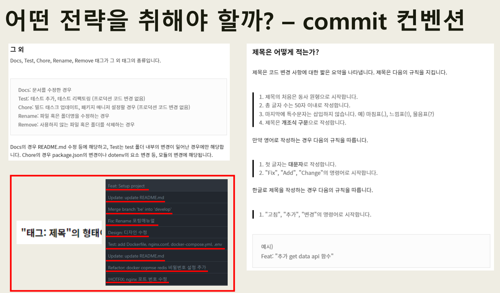

B209 특화프로젝트

### Branch

| GIT FLOW를 참조하여 개발할 것.

master ─ develop  ─ feature/user/ ...  
                    └ feature/shop/ ...
                    

### GIT Convention

| Git Merge Maintainer : 신창학(BE), 석정원(FE), 유혜빈(IFA)

